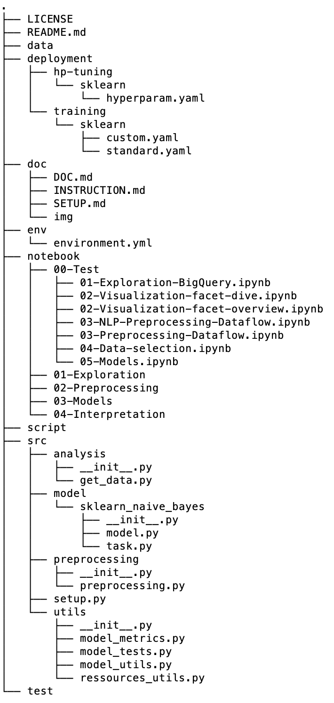

# Multilingual text classification using embedding, bert and deep learning

## Introduction
The idea is to explore recent new development in the area of NLP (Embedding, Bert, Deep Learning)
to classify documents with different languages (english, german, french and italian).

## Code structure
Here is the code structure that was developed to do machine learning on GCP (Dataflow, AI Platform Training and Prediction/Serving).
Clearly some adaption will be needed for each use case or is other tools are used.

## Jupyter Lab for exploration
You can use a local Jupyter Lab notebook as describe in this [link](doc/local_jupyter_lab_installation.md) or one created using on GCP using AI Platform Notebook.
You can also create one on GCP using some kind of automatic process and you can find more information in the [link](doc/creation_ai_platform_notebook.md).
If you use a local jupyter notebook you need GCP SDK to be installed to be able to access GCP services for training and serving.
You can also use you prefer IDE like PyCharm or Visual Studio Code.

## Python packages
For this project, we use Anaconda to create Anaconda python environment using conda to get all the pythons packages we need.
Instruction to create Anaconda python environment is describe in this 
[link](doc/conda_env.md).

## Code, training and serving
How to run the code to train and serve the models is describe in this 
[link](doc/instruction_run_code.md).

## Results
Main results will be describe here

## Conclusion
Conclusion of this project will appear here.
